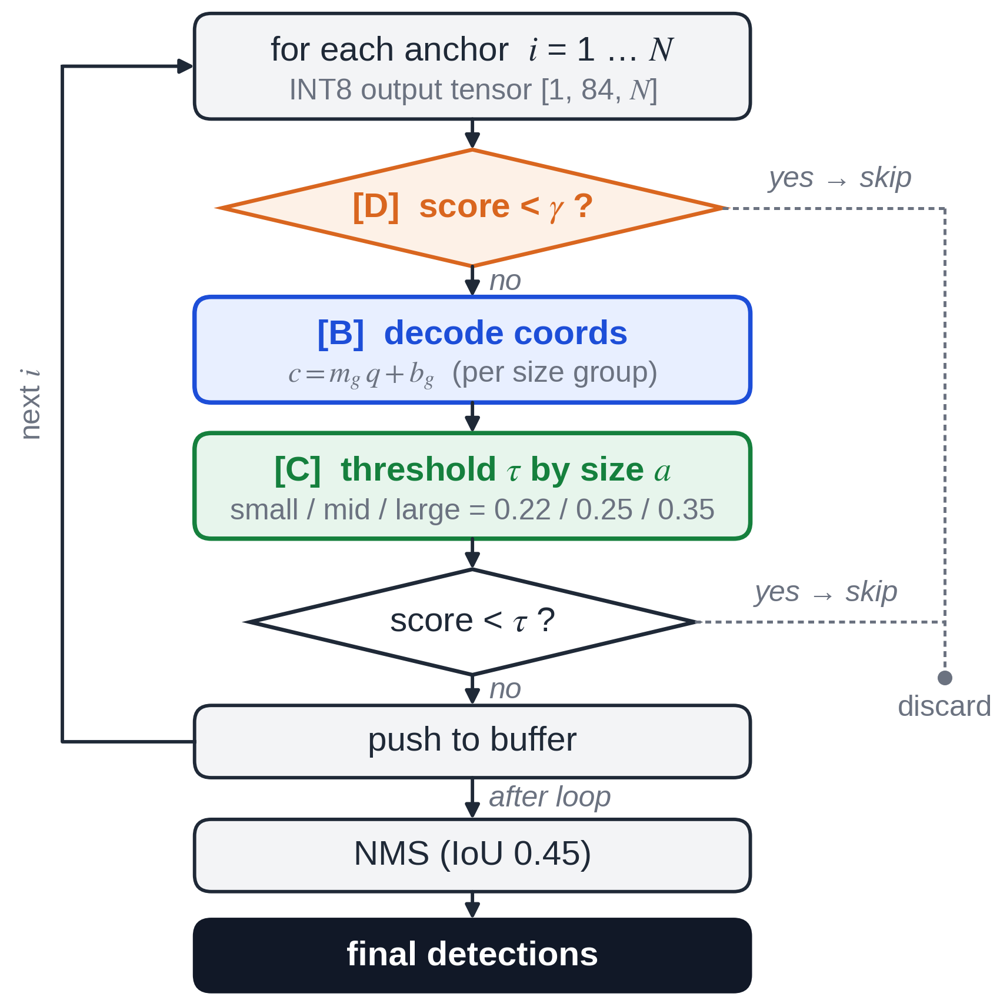

# ARM CPU 엣지 디바이스를 위한 INT8 양자화 YOLOv8의 후처리 최적화

**Post-Processing Optimization of INT8-Quantized YOLOv8 for ARM CPU Edge Devices**
*Quantization-Aware Calibration · Size-Aware Thresholding · Cache-Aware Selective Decoding*

> **한 줄 요약:** 엣지 디바이스에서 추론이 전체 지연시간의 99% 이상을 차지한다는 점에 착안해, **처리 속도(FPS)는 그대로 유지하면서** 후처리 단계만 개선하여 INT8 양자화 YOLOv8의 **정확도와 메모리 효율을 동시에** 끌어올렸습니다. Raspberry Pi 4 실측 기준 **mAP@0.5 0.6203 → 0.6407**, 후처리 지연시간 **65% 단축**.

---

## 📄 논문 정보

- **제목:** ARM CPU 엣지 디바이스를 위한 INT8 양자화 YOLOv8의 후처리 최적화
- **저자:** **김성빈 (제1저자)**, 박현철 (교신저자) — 국립한국교통대학교
- **게재:** 한국정보통신학회(KIICE) 2026년 추계 종합학술대회 논문집
- **논문 원문:** [📎 paper.pdf](./paper.pdf)
- **키워드:** INT8 Quantization · Object Detection · Post-processing · Selective Decoding · Edge Inference

---

## 🎯 연구 배경 / 문제

엣지 디바이스에 객체 검출기를 올리려면 모델을 INT8로 양자화해야 하지만, 두 가지 문제가 발생한다.

- **정확도 하락** — 양자화 과정에서 좌표 회귀가 훼손되어, 특히 **소형 객체** 검출 정확도가 떨어진다.
- **비효율적 후처리** — 표준 후처리는 수천 개의 모든 앵커를 디코딩하지만, 대부분은 결국 버려지는 앵커라 메모리 접근이 낭비된다.

본 연구는 **추론이 전체 지연시간의 99% 이상을 차지**한다는 관찰에서 출발한다. 후처리를 아무리 손봐도 전체 처리량(FPS)은 변하지 않으므로, **후처리는 속도 손실 없이 정확도와 메모리 효율을 끌어올릴 수 있는 "여유 공간"** 이 된다.

## 💡 제안 기법

하나의 단일 패스(single-pass) 후처리 루프 안에서 동작하는 세 가지 기법과 그 통합을 제안한다.

- **(B) 양자화 인식 보정 (Quantization-Aware Calibration)**
  양자화 오차가 객체 크기·좌표 채널마다 다르게 나타나는 점을 이용해, 크기 그룹별로 INT8 좌표를 FP32로 되돌리는 선형 보정을 적용 (보정 회귀 결정계수 R² 0.96~0.99).
- **(C) 크기 인식 신뢰도 임계값 (Size-Aware Thresholding)**
  소형 객체일수록 신뢰도 점수가 낮게 나오는 경향을 반영해, 객체 크기 그룹(소·중·대)마다 다른 신뢰도 임계값을 적용하여 놓치기 쉬운 소형 객체를 살린다.
- **(D) 캐시 인식 선택적 디코딩 (Cache-Aware Selective Decoding)**
  클래스 점수 채널만 먼저 순차적으로 스캔하고, 사전 임계값을 넘는 소수 앵커의 좌표만 디코딩. **검출 결과를 전혀 바꾸지 않으면서** 연산·메모리 비용만 절감한다.
- **(E) 통합 기법 (Integrated)**
  C와 D를 결합하여, B·C의 정확도 향상을 누적하면서도 D 수준의 낮은 후처리 비용을 유지한다.

<!-- 논문 그림을 figures 폴더에 올렸다면 아래 주석을 풀어 넣으세요 -->
<!--  -->

## 📊 주요 결과

**실험 환경:** Raspberry Pi 4 (Cortex-A72, 1.8GHz) · TensorFlow Lite XNNPACK (4 threads) · YOLOv8n / per-tensor INT8 · 검증 225장 (person 1,904개)

| 기법 | 후처리 지연(ms) | 디코딩 앵커 수 | mAP@0.5 | mAP@0.5:0.95 |
|:----|:---------------:|:-------------:|:-------:|:------------:|
| A — 표준 후처리 (baseline) | 0.3786 | 3,549 | 0.6203 | 0.4279 |
| B — 양자화 인식 보정 | 0.3565 | 3,549 | 0.6314 | 0.4323 |
| C — 크기 인식 임계값 | 0.4643 | 3,549 | 0.6298 | 0.4322 |
| D — 선택적 디코딩 | 0.1316 | 48 | 0.6203 | 0.4279 |
| C + D | 0.1338 | 49.9 | 0.6298 | 0.4322 |
| **E — 통합 기법** | **0.1324** | **49.9** | **0.6407** | **0.4368** |

**핵심 성과**

- 🎯 **정확도** — 통합 기법(E)이 표준(A) 대비 mAP@0.5를 **0.6203 → 0.6407 (+0.0204)**, mAP@0.5:0.95를 **+0.0089** 향상. B·C의 이득이 가법적으로 누적됨.
- ⚡ **속도** — 전체 지연시간 차이는 0.4%에 불과해 **동일한 16.3 FPS 유지**. 즉, 속도 손해 없이 정확도를 얻음.
- 💾 **효율** — 선택적 디코딩(D)이 디코딩 앵커를 **3,549개 → 약 48개**로 줄여 **후처리 지연을 65% 단축**하면서도 검출 결과는 표준과 완전히 동일.

## 🗂 저장소 구성

```
.
├── README.md      이 문서
├── paper.pdf      논문 원문
└── figures/       논문 그림 (파이프라인, 검출 결과 비교 등) — 선택
```

## 📚 인용 (Citation)

```bibtex
@inproceedings{kim2026postproc,
  title     = {ARM CPU 엣지 디바이스를 위한 INT8 양자화 YOLOv8의 후처리 최적화},
  author    = {김성빈 and 박현철},
  booktitle = {한국정보통신학회 2026년 추계 종합학술대회 논문집},
  year      = {2026}
}
```

---

📫 **Contact:** [GitHub @Kim-sung-been](https://github.com/Kim-sung-been)
